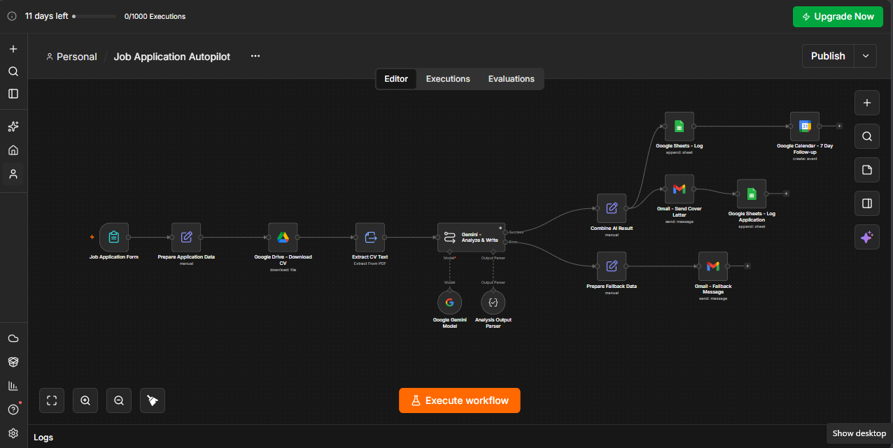
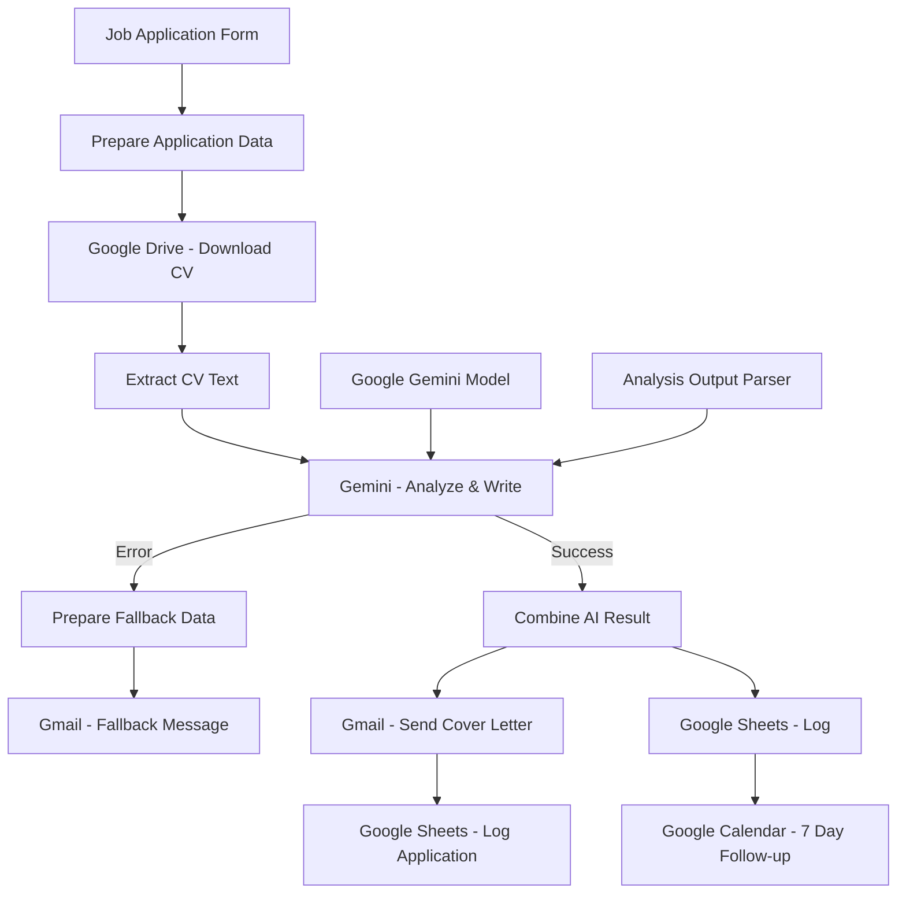

# 🤖 Job Application Autopilot



> **AI-powered n8n job application workflow that evaluates CV-to-job fit, generates a personalized cover letter, logs applications to Google Sheets, and schedules a 7-day follow-up.**

---

## 🚀 What it does

**Job Application Autopilot** is an n8n automation workflow designed to streamline the job application process from CV submission to follow-up.

The workflow:

1. Collects candidate and job information through an n8n form.
2. Downloads the candidate's CV from Google Drive.
3. Extracts text from the CV.
4. Uses **Google Gemini** to compare the CV against the job description.
5. Calculates an evidence-based **0–100 fit score**.
6. Identifies matching and missing skills.
7. Generates a personalized cover letter.
8. Emails the analysis and cover letter to the candidate.
9. Logs the application to Google Sheets.
10. Creates a Google Calendar follow-up event for 7 days later.
11. Provides a fallback email path if the AI analysis fails.

---


## 🚀 How to Use

### Step 1: Import the Workflow

Import the provided n8n JSON workflow into your n8n instance.

### Step 2: Configure Credentials

Open the relevant nodes and select your own credentials for:

- Google Drive
- Google Gemini
- Gmail
- Google Sheets
- Google Calendar

**Do not rely on credential IDs from the exported workflow.** Credential references are specific to the original n8n environment.

### Step 3: Configure Google Sheets

Create or select the spreadsheet where applications should be stored.

Make sure the sheet contains the columns required by the logging node, including:

```text
Date
Name
Email
Phone
Company
Position
Fit Score
Fit Summary
Matching Skills
Missing Skills
Reasoning
Cover Letter
Portfolio
Follow-up Date
Status
AI Status
```

### Step 4: Configure Google Drive Access

The applicant must provide a Google Drive CV URL that the configured Google Drive credential can access.

### Step 5: Test the Workflow

Submit a test application containing:

- A real or test CV
- A sample job description
- Candidate details
- Company and position information

Then verify:

1. CV downloads correctly.
2. CV text is extracted.
3. Gemini returns structured output.
4. Email is delivered.
5. Application is logged.
6. Calendar follow-up is created.

### Step 6: Activate the Workflow

After testing all integrations, activate the n8n workflow.

---
## ✨ Key Features

### 📝 Application Intake

The workflow starts with an n8n form titled **Job Application Autopilot**.

The form collects:

- **Full Name** — required
- **Email** — required
- **Phone** — optional
- **Company** — required
- **Job Position** — required
- **Job Description** — required
- **Portfolio / GitHub URL** — optional
- **CV Link (Google Drive URL)** — required

The form is designed so a candidate can submit their CV and target-job information in a single step.

---

## 🧠 AI-Powered CV Analysis

The core evaluation is performed by **Google Gemini**.

The AI is explicitly instructed to use only information supported by the provided CV and job description. It must not invent skills, experience, projects, certifications, education, achievements, tools, or responsibilities.

### Scoring Rubric

The final fit score is calculated out of **100 points**:

| Criterion | Maximum Score |
|---|---:|
| Core / Required Skills | 30 |
| Relevant Experience | 20 |
| Projects / Practical Work | 15 |
| Education / Degree | 10 |
| Job Responsibilities Match | 10 |
| Certifications | 5 |
| Tools / Technologies | 5 |
| ATS / Important JD Terminology | 5 |
| **Total** | **100** |

The analysis also produces a separate **confidence score from 0–100**, representing how strongly the evaluation is supported by explicit CV evidence.

### Evidence Rules

The AI evaluation distinguishes between:

- **Matched**
- **Partial Match**
- **Not Found**

For missing information, the workflow instructs the AI to use:

> `Not found in the provided CV.`

Each scoring criterion is expected to contain supporting reasoning and evidence.

---

## ✉️ Personalized Cover Letter

After evaluating the candidate, Gemini generates a personalized professional cover letter.

The successful email includes:

- Candidate name
- Company
- Job position
- AI fit score
- Fit summary
- Matching skills
- Missing / weaker areas
- Detailed reasoning
- Personalized cover letter
- Confirmation that the application was logged
- Notice that a 7-day follow-up is scheduled

---

## 🔄 Workflow Architecture



---

## 🏗️ Workflow Components

The imported n8n workflow contains **14 nodes**.

| Node | Purpose |
|---|---|
| **Job Application Form** | Collects candidate and job information |
| **Prepare Application Data** | Normalizes form data and calculates submission/follow-up timestamps |
| **Google Drive - Download CV** | Downloads the CV from the supplied Google Drive URL |
| **Extract CV Text** | Extracts readable text from the CV PDF |
| **Gemini - Analyze & Write** | Performs CV/job matching and generates the cover letter |
| **Google Gemini Model** | Provides the Gemini chat model to the AI chain |
| **Analysis Output Parser** | Forces the AI result into a structured JSON format |
| **Prepare Fallback Data** | Builds fallback application data when AI processing fails |
| **Gmail - Fallback Message** | Notifies the candidate that AI analysis is temporarily unavailable |
| **Combine AI Result** | Combines application data with the successful Gemini result |
| **Gmail - Send Cover Letter** | Sends the analysis and generated cover letter |
| **Google Sheets - Log Application** | Appends application information after the email step |
| **Google Sheets - Log** | Logs the successful AI result and continues to follow-up scheduling |
| **Google Calendar - 7 Day Follow-up** | Creates a 30-minute follow-up calendar event 7 days after submission |

---

## 🔢 Data Flow

### 1. Form Submission

The candidate submits their details through the n8n form.

### 2. Data Preparation

The workflow creates normalized fields including:

- `candidate_name`
- `candidate_email`
- `phone`
- `company`
- `job_title`
- `job_description`
- `portfolio_url`
- `cv_link`
- `submitted_at`
- `follow_up_date`

The follow-up date is calculated as **7 days after submission**.

### 3. CV Retrieval

The Google Drive node downloads the CV using the submitted Google Drive URL.

Google Docs files can be converted to PDF during the download step.

### 4. Text Extraction

The downloaded PDF is processed by **Extract CV Text**, producing the CV text that is passed to Gemini.

### 5. AI Evaluation

Gemini receives:

- Candidate CV text
- Job description
- Candidate name
- Company
- Position

It then performs the structured evaluation and cover-letter generation.

### 6. Structured Output

The **Analysis Output Parser** expects a structured result containing fields such as:

```json
{
  "fit_score": 85,
  "confidence": 92,
  "fit_summary": "...",
  "score_breakdown": {},
  "matching_skills": [],
  "missing_skills": [],
  "evidence": [],
  "reasoning": "...",
  "cover_letter": "..."
}
```

### 7. Success Path

When Gemini succeeds:

```text
Gemini
  ↓
Combine AI Result
  ↓
├── Gmail - Send Cover Letter
│      ↓
│   Google Sheets - Log Application
│
└── Google Sheets - Log
       ↓
   Google Calendar - 7 Day Follow-up
```

### 8. Failure Path

If the Gemini node returns an error:

```text
Gemini Error
    ↓
Prepare Fallback Data
    ↓
Gmail - Fallback Message
```

The candidate is informed that the automated AI analysis is temporarily unavailable while the application can still be recorded.

---

## 📊 Output Data

The workflow is designed to produce application records containing fields such as:

| Field | Description |
|---|---|
| `candidate_name` | Candidate's name |
| `candidate_email` | Candidate email |
| `phone` | Candidate phone |
| `company` | Target company |
| `job_title` | Target position |
| `portfolio_url` | Portfolio or GitHub URL |
| `cv_link` | Google Drive CV URL |
| `submitted_at` | Application submission timestamp |
| `follow_up_date` | Scheduled follow-up timestamp |
| `fit_score` | AI fit score from 0–100 |
| `fit_summary` | Overall suitability summary |
| `matching_skills` | Skills supported by CV evidence |
| `missing_skills` | Missing or weaker skills |
| `reasoning` | Detailed scoring explanation |
| `cover_letter` | Generated cover letter |
| `ai_status` | AI processing status |

---

## 📈 Google Sheets Logging

The workflow uses Google Sheets to maintain an application log.

The intended application record includes:

- Date
- Name
- Email
- Phone
- Company
- Position
- Fit Score
- Fit Summary
- Matching Skills
- Missing Skills
- Reasoning
- Cover Letter
- Portfolio
- Follow-up Date
- Status
- AI Status

This creates a centralized record of applications and their AI-generated evaluation.

---

## 📅 Automated Follow-Up

A Google Calendar node creates the follow-up event using the calculated `follow_up_date`.

The event duration is **30 minutes**.

The date is generated automatically using:

```text
Current time + 7 days
```

This means every successfully processed application can have a follow-up scheduled automatically.

---

## 🔐 Required Integrations

The workflow depends on the following n8n integrations:

### Google Drive

Used to retrieve the candidate CV from the supplied Google Drive URL.

### Google Gemini

Used for:

- CV analysis
- Job-description matching
- Fit scoring
- Evidence generation
- Missing-skill detection
- Cover-letter generation

The configured Gemini temperature is **0.4**.

### Gmail

Used to send:

- Successful AI analysis + cover letter
- Fallback notification when AI analysis fails

### Google Sheets

Used to log application information.

### Google Calendar

Used to create the 7-day follow-up event.

---

## 🛠️ Prerequisites

Before importing and running the workflow, make sure you have:

- **n8n**
- A configured **Google Drive OAuth2** credential
- A configured **Google Gemini / Google PaLM API** credential
- A configured **Gmail OAuth2** credential
- A configured **Google Sheets OAuth2** credential
- A configured **Google Calendar OAuth2** credential
- A Google Sheet prepared for application logging
- A Google Calendar available for follow-up scheduling
- CVs accessible through Google Drive

---


## 🧩 AI Prompt Design

The Gemini agent follows an evidence-first evaluation strategy.

Important constraints include:

- Use only explicit CV and job-description information.
- Never invent candidate qualifications.
- Do not assume knowledge of related technologies.
- Do not award points for unsupported claims.
- Separate exact matches, partial matches, and missing requirements.
- Ensure the final score equals the sum of the rubric criteria.
- Keep the maximum score at exactly 100.
- Keep confidence separate from fit score.
- Generate a personalized cover letter without inventing information.

This makes the workflow more suitable for transparent CV screening than a generic "rate this resume" prompt.

---

## ⚠️ Important Configuration Notes

The exported workflow contains environment-specific n8n credential references and Google resource references. When importing it into another n8n instance, review every integration node and select the appropriate credentials/resources for your environment.

The current exported workflow also contains Google Sheets mappings that should be **verified before production use**, particularly fields such as:

- `Position`
- `Matching Skills`
- `Missing Skills`
- `Portfolio`
- `Follow-up Date`

The workflow export currently contains mappings for these fields that may not correspond to the intended application-data fields. Test the resulting spreadsheet rows before relying on the automation in production.

---

## 🔒 Privacy & Security

This workflow processes potentially sensitive applicant information, including:

- Name
- Email
- Phone
- CV content
- Employment history
- Education
- Skills
- Job application information

Before deploying it for real candidates:

- Use appropriate Google account permissions.
- Restrict access to the Google Sheet.
- Restrict access to candidate CVs.
- Avoid sharing workflow exports containing credential information.
- Review your organization's data-retention requirements.
- Verify the privacy and data-processing requirements applicable to the AI provider you use.

---

## 🧪 Testing Checklist

Before production deployment, verify:

- [ ] Form accepts all required fields.
- [ ] Invalid email addresses are rejected appropriately.
- [ ] Google Drive CV downloads successfully.
- [ ] PDF text extraction works.
- [ ] Gemini credentials are valid.
- [ ] Gemini returns valid structured JSON.
- [ ] Fit score is between 0 and 100.
- [ ] Score components total 100 maximum.
- [ ] Matching skills are populated correctly.
- [ ] Missing skills are populated correctly.
- [ ] Cover letter is generated.
- [ ] Success email is delivered.
- [ ] Failure email is delivered when AI processing fails.
- [ ] Google Sheets receives the intended fields.
- [ ] Google Calendar creates the follow-up event.
- [ ] Follow-up date is 7 days after submission.
- [ ] Production credentials/resources replace environment-specific references.

---

## 🗺️ End-to-End Workflow

```text
Candidate
   │
   ▼
Job Application Form
   │
   ▼
Prepare Application Data
   │
   ▼
Download CV from Google Drive
   │
   ▼
Extract CV Text
   │
   ▼
Google Gemini
   │
   ├─────────────── Success ───────────────┐
   │                                       │
   ▼                                       ▼
Combine AI Result                    Fallback Data
   │                                       │
   ├──► Send Analysis + Cover Letter       └──► Fallback Email
   │
   └──► Log / Continue
           │
           ▼
     Google Sheets
           │
           ▼
   Google Calendar
           │
           ▼
   7-Day Follow-Up
```

---

## 📁 Workflow File

The n8n workflow can be imported directly from the provided JSON export:

```text
Job Application Autopilot (1).json
```

The workflow contains **14 nodes** and uses n8n's standard workflow connection structure.

---

## 💡 Future Improvements

Potential improvements for a production-ready version include:

- Add automatic application status tracking.
- Add job-application URL and source fields.
- Add a dedicated recruiter/employer contact field.
- Store the complete score breakdown in Google Sheets.
- Add retry logic for temporary Gemini/API failures.
- Add duplicate-application detection.
- Add configurable follow-up intervals.
- Add a second follow-up reminder.
- Add Slack or Microsoft Teams notifications.
- Add Gmail labels for processed applications.
- Add a dashboard for application analytics.
- Fix and validate the currently exported Google Sheets field mappings.
- Add stronger validation for Google Drive permissions and CV file types.

---

## 📄 License

No explicit open-source license is defined in the provided n8n workflow export.

If you publish this project publicly, add a `LICENSE` file and update this section accordingly.
